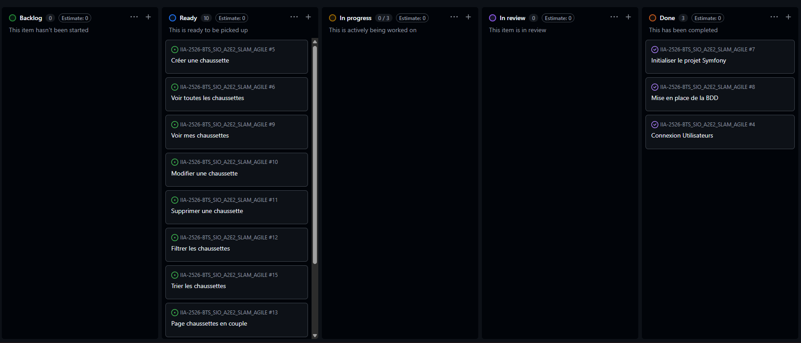

# 🟢 Sprint 1

---

## 🎯 Sprint Goal

1. Installer Symfony  
2. Configurer GitHub  
3. Configurer l’environnement  
4. Créer la base de données  
5. Créer l’entité User  
6. Tester la connexion BDD  

---

# 📦 Sprint Backlog (tâches détaillées)

---

## 🧱 1. Installation & environnement

- Installer Symfony  
- Vérifier PHP / Composer  
- Lancer serveur local  
- Vérifier que le projet démarre sans erreur  

---

## 🔗 2. GitHub

- Créer repository GitHub  
- Lier projet local ↔ GitHub  
- Faire un premier commit  
- Vérifier push/pull fonctionnel  

---

## ⚙️ 3. Configuration environnement

- Configurer fichier `.env`  
- Définir `DATABASE_URL`  
- Vérifier les variables d’environnement  

---

## 🗄️ 4. Base de données

- Créer base MySQL  
- Tester connexion Symfony ↔ BDD  
- Lancer une première migration vide  

---

## 👤 5. Entité User

- Créer entité User  
- Définir les champs :
  - id  
  - username  
- Générer migration  
- Appliquer migration en base  

---

## 🔌 6. Test connexion BDD

- Vérifier connexion Symfony  
- Tester requêtes simples  
- Corriger erreurs éventuelles  

---

# 📅 Daily Meeting

---

## Jour 1

* Vigile : va installer Symfony et vérifier l’environnement PHP
* Mahmoud : configure Composer et aide sur l’installation
* Vigile : signale un problème de version PHP (trop ancienne)
* Mahmoud : propose de faire une mise à jour de PHP

---

## Jour 2

* Vigile : initialise le repo GitHub et fait le premier commit
* Mahmoud : s’occupe du lien entre projet local et GitHub
* Vigile : rencontre un problème d’authentification Git
* Mahmoud : propose d’utiliser un token à la place du mot de passe

---

## Jour 3

* Vigile : commence la config `.env` et la BDD
* Mahmoud : vérifie la configuration MySQL
* Vigile : indique qu’il n’est pas très à l’aise avec la config BDD
* Problème remonté : mot de passe incorrect pour MySQL

---

## Jour 4

* Vigile : crée la base de données
* Mahmoud : aide à tester la connexion Symfony ↔ BDD
* Problème : connexion partiellement fonctionnelle
* Mahmoud : suggère de revoir `DATABASE_URL`

---

## Jour 5

* Vigile : crée l’entité User
* Mahmoud : gère les migrations
* Problème : erreur Doctrine migration
* Vigile : dit qu’il galère avec Doctrine

---

## Jour 6

* Vigile : teste la connexion BDD
* Mahmoud : aide à corriger les erreurs
* Les deux : valident que la connexion fonctionne
* Aucun blocage majeur

---

## Jour 7

* Vigile : finalise le projet
* Mahmoud : vérifie la propreté du code
* Les deux : font une vérification globale
* Sprint validé

---

# 📅 Daily Récap

---

## Jour 1
- Installation Symfony  
- Mise en place environnement PHP  
- ❌ Problème : version PHP incompatible → mise à jour nécessaire  

---

## Jour 2
- Initialisation GitHub  
- Premier commit  
- ❌ Problème : erreur push Git (authentification)  

---

## Jour 3
- Configuration `.env`  
- Début configuration BDD  
- ❌ Problème : connexion MySQL refusée (mot de passe incorrect)  

---

## Jour 4
- Création base de données  
- Test connexion Symfony ↔ BDD  
- ❌ Problème : configuration partielle de la connexion  

---

## Jour 5
- Création entité User  
- Migration en base  
- ❌ Problème : erreur Doctrine migration  

---

## Jour 6
- Tests connexion BDD  
- Correction des bugs  
- Stabilisation du projet  

---

## Jour 7
- Finalisation du sprint  
- Nettoyage du projet  
- Vérification globale  

---

# 🔁 Sprint Retrospective

---

## 👍 Keep (ce qui a bien marché)

- Installation rapide de Symfony  
- GitHub bien configuré  

---

## 👎 Drop (problèmes rencontrés)

- Erreurs de configuration BDD  
- Configuration `.env` complexe  

---

## 🚀 Try (améliorations)

- Mieux organiser les étapes d’installation  
- Tester la BDD plus tôt  
- Faire des commits plus fréquents  

---

# 🔍 Sprint Review

---

---

## 📌 À présenter

- Projet Symfony lancé  
- Repository GitHub fonctionnel  
- Connexion BDD OK  
- Entité User créée et migrée  

---

## 🎬 Démo

- Lancer le serveur Symfony  
- Montrer la connexion à la base de données  
- Afficher la table User dans la BDD  

---