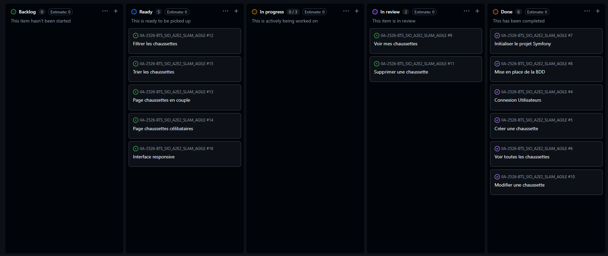

# 🟢 Sprint 2

---

## 🎯 Sprint Goal

1. Créer l'entité Chaussette  
2. Mettre en place les bases CRUD  
3. Tester les premières interactions avec la BDD  

---

# 📦 Sprint Backlog (tâches détaillées)

---

## 🧦 1. Entité Chaussette

- Créer entité `Chaussette`  
- Définir les champs :
  - id  
  - taille  
  - couleur  
  - type  
  - marque  
  - commentaire  
  - statut  
- Ajouter relation avec `User`  
- Générer migration  
- Appliquer migration  

---

## ➕ 2. Ajout d’une chaussette

- Créer contrôleur `ChaussetteController`  
- Créer méthode `create`  
- Générer formulaire Symfony  
- Gérer la soumission du formulaire  
- Enregistrer en base de données  
- Rediriger avec message de succès  

---

## 📋 3. Consultation des chaussettes

- Créer méthode `index`  
- Récupérer les chaussettes depuis la BDD  
- Afficher dans une vue Twig  
- Ajouter un affichage propre (table / cards)  

---

## ✏️ 4. Modification d’une chaussette

- Créer méthode `edit`  
- Pré-remplir le formulaire avec les données existantes  
- Gérer la mise à jour en base  
- Ajouter message de confirmation  

---

## 🗑️ 5. Suppression d’une chaussette

- Créer méthode `delete`  
- Ajouter bouton supprimer dans la liste  
- Gérer suppression sécurisée (CSRF token)  
- Vérifier suppression en base  

---

## 👤 6. Chaussettes du compte courant

- Filtrer les chaussettes par utilisateur connecté  
- Adapter la requête repository (`findByUser`)  
- Sécuriser l’accès (pas voir celles des autres)  
- Tester avec plusieurs utilisateurs  

---

# 📅 Daily Récap

---

## Jour 1

* Création entité `Chaussette`
* Définition des champs (taille, couleur, type, marque, commentaire, date)
* Génération migration
* ✅ Pas de problème majeur

---

## Jour 2

* Mise en place relation `User ↔ Chaussette`
* Migration en base
* ❌ Problème : erreur de relation Doctrine (mapping incorrect)

---

## Jour 3

* Création du contrôleur `ChaussetteController`
* Développement de l’ajout de chaussette
* Formulaire Symfony fonctionnel
* ❌ Problème : données non persistées (oubli persist/flush)

---

## Jour 4

* Consultation des chaussettes (`index`)
* Affichage dans Twig
* Mise en forme (table simple)
* ✅ Fonctionnel

---

## Jour 5

* Modification des chaussettes (`edit`)
* Pré-remplissage formulaire
* Mise à jour en base
* ❌ Problème : champ mal bindé dans le formulaire

---

## Jour 6

* Suppression des chaussettes
* Sécurisation avec CSRF
* Début filtrage par utilisateur connecté
* ❌ Problème : accès non restreint aux données

---

## Jour 7

* Finalisation suppression
* Implémentation "chaussettes du compte courant"
* Tests globaux
* 🔄 Feature en review (suppression + filtrage utilisateur)

---

# 🔁 Sprint Retrospective

---

## 👍 Keep (ce qui a bien marché)

* Mise en place rapide du CRUD
* Bonne compréhension de Symfony Forms
* Affichage Twig efficace

---

## 👎 Drop (problèmes rencontrés)

* Erreurs fréquentes sur Doctrine (relations, persist)
* Problèmes de sécurité sur les données utilisateur

---

## 🚀 Try (améliorations)

* Tester chaque feature directement après implémentation
* Mieux anticiper les relations entre entités
* Ajouter des tests pour sécuriser les accès utilisateurs

---

# 🔍 Sprint Review

---

---

## 📌 À présenter

* CRUD complet des chaussettes
* Ajout / modification / consultation fonctionnels
* Suppression implémentée (en cours de validation)
* Filtrage par utilisateur (en review)

---

## 🎬 Démo

* Ajouter une chaussette
* Modifier une chaussette
* Afficher la liste des chaussettes
* Montrer la suppression (si validée)
* Montrer le filtrage par utilisateur connecté

---
