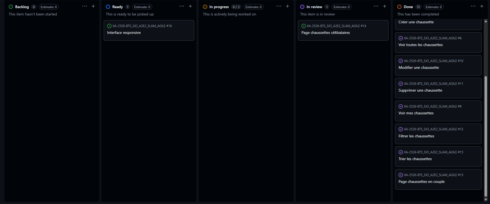

# 🟢 Sprint 3

---

## 🎯 Sprint Goal

1. Ajouter des filtres sur la page de consultation de chaussettes
2. Ajouter des options de tri
3. Créer une page des chaussettes en couple
4. Créer une page des chaussettes solitaires

---

# 📦 Sprint Backlog (tâches détaillées)

---

## 🔍 1. Filtres sur les chaussettes

* Ajouter champs de filtre dans l’interface :

  * couleur
  * taille
  * type
  * statut
* Créer un formulaire de filtre
* Adapter la requête dans le repository
* Gérer filtres combinés
* Tester les résultats

---

## 🔃 2. Options de tri

* Ajouter options de tri :

  * taille
  * marque
  * statut
* Ajouter contrôles UI (select / boutons)
* Adapter requêtes avec `ORDER BY`
* Conserver filtres + tri en même temps
* Tester comportement

---

## ❤️ 3. Chaussettes en couple

* Ajouter champ `isMatched` (ou équivalent)
* Mettre à jour l’entité + migration
* Créer méthode repository (`findMatched`)
* Créer route + contrôleur
* Créer vue dédiée
* Tester affichage

---

## 🧍 4. Chaussettes solitaires

* Créer méthode repository (`findUnmatched`)
* Filtrer les chaussettes non appariées
* Créer route + contrôleur
* Créer vue dédiée
* Vérifier cohérence avec "en couple"

---
# 📅 Daily Récap
---

## Jour 1

* Mise en place des filtres (UI)
* Ajout des champs dans le formulaire
* ❌ Problème : récupération des données GET mal gérée

---

## Jour 2

* Implémentation des filtres côté repository
* Gestion des filtres combinés
* ✅ Fonctionnel

---

## Jour 3

* Ajout des options de tri
* Implémentation `ORDER BY`
* ❌ Problème : tri qui écrase les filtres

---

## Jour 4

* Correction interaction filtres + tri
* Tests globaux
* ✅ Fonctionnel

---

## Jour 5

* Ajout du champ `isMatched`
* Migration base de données
* Création logique "chaussettes en couple"
* ❌ Problème : données existantes non initialisées

---

## Jour 6

* Création page chaussettes en couple
* Création page chaussettes solitaires
* Mise en place des routes et vues
* ✅ Fonctionnel

---

## Jour 7

* Tests complets (filtres, tri, pages dédiées)
* Corrections mineures
* Finalisation du sprint
* ✅ Toutes les features validées

---

# 🔁 Sprint Retrospective

---

## 👍 Keep (ce qui a bien marché)

* Bonne mise en place des filtres dynamiques
* Tri efficace et flexible
* Séparation claire des fonctionnalités

---

## 👎 Drop (problèmes rencontrés)

* Difficultés sur la gestion combinée filtres + tri
* Problèmes de cohérence des données (`isMatched`)

---

## 🚀 Try (améliorations)

* Prévoir la structure des données en amont
* Ajouter des tests pour les requêtes complexes
* Factoriser la logique des filtres/tri

---

# 🔍 Sprint Review

---

---

## 📌 À présenter

* Système de filtres fonctionnel
* Options de tri opérationnelles
* Page des chaussettes en couple
* Page des chaussettes solitaires

---

## 🎬 Démo

* Filtrer les chaussettes (couleur, taille, etc.)
* Trier les résultats
* Naviguer vers page "en couple"
* Naviguer vers page "solitaires"

---
