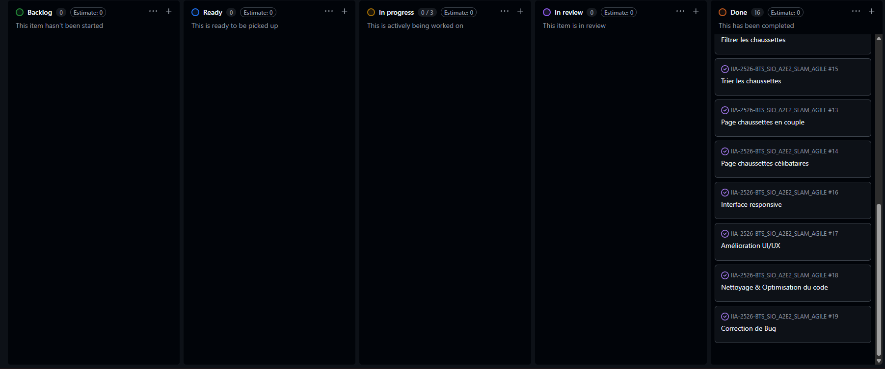

# 🟢 Sprint 4 — Amélioration & Finalisation

---

## 🎯 Sprint Goal

- Améliorer le responsive
- Améliorer l’UX/UI
- Nettoyer et optimiser le code
- Corriger les bugs restants
- Finaliser l’application

---

## 📦 Sprint Backlog

---

### 📱 1. Responsive Design

- Définir les breakpoints (mobile / tablette)
- Adapter la page liste des chaussettes
- Adapter les formulaires (création / modification)
- Adapter la navigation (menu responsive)
- Tester sur plusieurs tailles d’écran

---

### 🎨 2. Amélioration UX/UI

- Améliorer la lisibilité des pages
- Uniformiser le design (couleurs, boutons)
- Ajouter des messages utilisateur :
  - ✅ Succès
  - ❌ Erreur
- Améliorer la navigation entre les pages
- Ajouter des confirmations (suppression, actions)

---

### 🧹 3. Nettoyage & Optimisation du Code

- Supprimer le code inutile
- Factoriser le code (services, fonctions réutilisables)
- Améliorer le nommage des variables et méthodes
- Optimiser les requêtes Doctrine
- Vérifier la structure MVC

---

### 🐞 4. Correction de Bugs

- Tester toutes les fonctionnalités :
  - CRUD chaussette
  - Connexion utilisateur
  - Filtres et tri
- Corriger les erreurs détectées
- Vérifier les cas limites :
  - Liste vide
  - Erreurs utilisateur

---

### 🚀 5. Finalisation du Projet

- Vérification globale de l’application
- Nettoyage des fichiers inutiles
- Vérification des routes
- Préparation de la démo finale

---

## 📅 Daily Récap

---

### 📆 Jour 1

- Début du responsive
- Adaptation page liste
- ❌ Problème : éléments qui débordent sur mobile

---

### 📆 Jour 2

- Responsive formulaires
- Début amélioration UX
- ❌ Problème : champs mal alignés

---

### 📆 Jour 3

- Ajout des messages utilisateur
- Amélioration de la navigation
- ❌ Problème : messages non affichés correctement

---

### 📆 Jour 4

- Refactorisation du code
- Nettoyage des controllers
- ❌ Problème : erreurs après refactor

---

### 📆 Jour 5

- Optimisation des requêtes BDD
- Correction des bugs
- ❌ Problème : filtre non fonctionnel après modification

---

### 📆 Jour 6

- Tests complets de l’application
- Correction des bugs restants
- Stabilisation

---

### 📆 Jour 7

- Finalisation du projet
- Préparation de la démo
- Vérification globale

---

## 🔁 Sprint Retrospective

---

### 👍 Keep

- Amélioration visible de l’interface
- Application plus fluide
- Code plus propre

---

### 👎 Drop

- Difficultés avec le responsive
- Régressions après refactor

---

### 🚀 Try

- Tester après chaque modification
- Faire des commits plus petits et réguliers
- Anticiper le responsive dès le début du projet

---

## 🔍 Sprint Review

---

---

### 📌 À présenter

- 📱 Application responsive
- 🎨 Interface améliorée
- 🧹 Code propre et structuré
- ✅ Fonctionnalités complètes et stables

---

### 🎬 Démo

- Tester le site sur mobile (mode inspecteur)
- Créer / modifier / supprimer une chaussette
- Utiliser filtres et tri
- Montrer les messages utilisateur

---

## 🧦 Projet : Chaussettes Perdues

Sprint dédié à la **finalisation du produit**, avec un focus sur :

- Expérience utilisateur
- Qualité du code
- Stabilité globale

---
